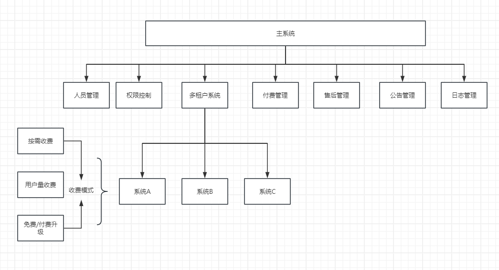
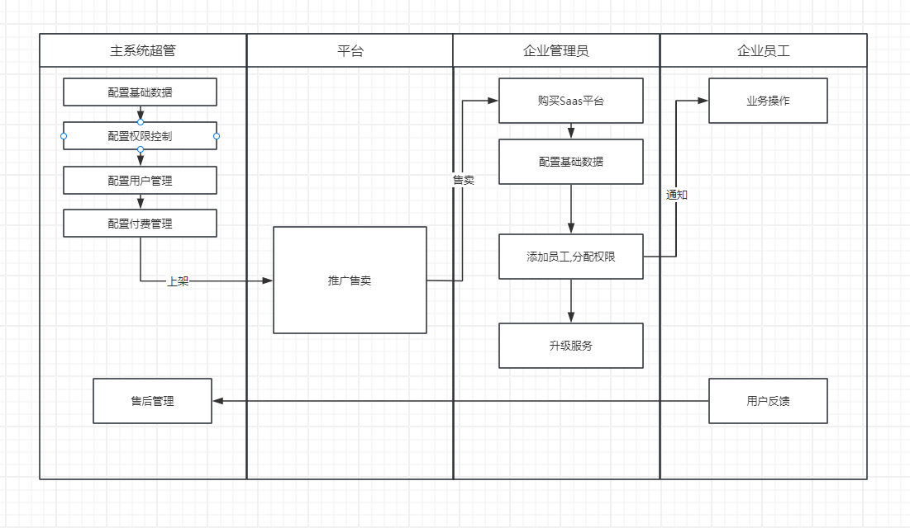

软件即服务 (SaaS) 指一种基于云技术的软件交付模式，具体而言，就是由云技术提供商开发和维护云技术应用软件，提供自动软件更新，并通过互联网以即用即付费的方式将软件提供给客户。其中，所有硬件何传统软件，包括中间件、应用软件和安全性等均由公有云技术提供商托管。因此，SaaS 客户可以大幅降低成本，部署、扩展和升级业务解决方案的速度也显著快于本地部署系统和软件，而且还可以更加准确地预测总拥有成本。

# 一、Saas概述

## SaaS的优势

1. **成本效益**：SaaS模型允许用户按需支付，避免了传统软件购买的高昂前期成本，用户只需为实际使用的服务支付费用。
2. **易于维护和升级**：服务提供商负责软件的维护和升级，确保所有用户都能够访问最新版本的软件，无需用户自己进行复杂的更新过程。
3. **可访问性和灵活性**：由于软件托管在云端，用户可以从任何地点通过互联网连接访问应用程序，提高了工作的灵活性和移动性。
4. **快速部署**：SaaS应用通常可以迅速部署，用户可以在很短的时间内开始使用新的软件或服务。
5. **可扩展性**：根据业务需求的变化，用户可以轻松增加或减少服务的使用量，SaaS模型提供了极大的灵活性来适应业务规模的扩张或缩小。

## SaaS的挑战

1. **数据安全和隐私**：将数据存储在云端可能会引发安全和隐私问题。虽然许多SaaS提供商采取了高级加密和安全措施，但用户仍需仔细评估服务提供商的安全性。
2. **依赖网络连接**：SaaS应用依赖于互联网连接，如果网络不稳定或速度慢，可能会影响到应用程序的性能和可访问性。
3. **定制化限制**：虽然许多SaaS提供商允许一定程度的定制，但这些服务的定制化程度可能不如在企业内部开发或安装的软件。
4. **数据迁移问题**：如果用户决定更换服务提供商，数据迁移可能是一个挑战，特别是当涉及到大量数据和不同格式时。

## Saas软件和传统软件的区别？

### 部署方式

* **SaaS软件**：托管在云端，服务提供商负责维护数据中心、服务器、软件应用等。用户通过互联网访问服务，不需要在本地安装软件。
* **传统软件**：通常需要在用户的个人计算机或企业内部服务器上直接安装和运行。这要求用户购买和维护硬件设施。

### 访问方式

* **SaaS软件**：通过任何具有互联网连接的设备访问。用户只需使用浏览器或专用应用即可从任何地点访问软件。
* **传统软件**：访问通常限于安装软件的设备，移动性和灵活性较低。

### 成本结构

* **SaaS软件**：遵循订阅模式，用户按月或按年支付使用费用。这种模式通常包括软件的使用、维护和升级费用，减少了初期投资。
* **传统软件**：往往需要前期购买许可证的高额一次性费用，此外，可能还需要支付额外的维护和升级费用。

### 更新和维护

* **SaaS软件**：服务提供商负责软件的定期更新和维护，确保所有用户都能访问最新版本，无需用户介入。
* **传统软件**：用户需自行负责软件的更新和维护。这可能需要额外的时间和资源，以确保软件保持最新状态。

### 定制和集成

* **SaaS软件**：虽然许多SaaS解决方案提供一定程度的定制性，但可能不如传统软件灵活。集成其他应用或服务可能受到限制，取决于服务提供商的支持。
* **传统软件**：通常提供更高程度的定制性，允许企业根据具体需求调整软件。也更容易与现有的IT基础设施和其他应用集成。

### 数据控制

* **SaaS软件**：数据存储在服务提供商的服务器上，虽然这提供了高可访问性，但也引发了数据安全和隐私方面的担忧。
* **传统软件**：企业或个人完全控制自己的数据和相关的安全措施，数据存储在本地或指定的服务器上。

# 二、如何设计一个saas系统

设计一个SaaS系统是一个复杂的过程，需要仔细考虑多个方面，以确保系统既能满足用户的需求，又能高效、安全地运行。以下是设计SaaS系统时需要考虑的几个关键步骤和原则：

## 需求分析和规划

* **了解目标市场**：研究目标用户群体，了解他们的需求、痛点和使用习惯。
* **定义服务范围**：明确SaaS产品将提供哪些功能和服务。
* **制定价值主张**：确定产品如何解决用户问题，与竞争对手相比有何优势。

## 多租户架构设计

* **数据隔离**：设计数据库架构，确保每个租户的数据安全且相互隔离，常用方法包括数据库级别、模式级别或租户ID标识隔离。
* **资源共享与隔离**：确保系统资源（如计算和存储资源）能够在租户之间有效共享，同时避免“邻居效应”影响性能。

## 可扩展性和可靠性

* **微服务架构**：采用微服务架构可以提高系统的可扩展性和灵活性，方便独立开发、测试、部署和扩展各个服务。
* **自动伸缩**：设计系统能够根据负载自动调整资源使用，以应对访问量的波动。

## 安全性设计

* **认证与授权**：实现强大的用户认证和授权机制，如多因素认证、角色基于访问控制（RBAC）等。
* **数据加密**：确保存储和传输的数据都进行加密处理，保护用户数据安全。
* **合规性和隐私**：遵守相关法律法规，如GDPR、HIPAA等，确保用户数据的合法处理。

## 用户体验和界面设计

* **响应式设计**：确保SaaS应用在不同设备和屏幕尺寸上都能提供良好的用户体验。
* **直观的用户界面**：设计易于使用的界面，减少用户学习成本，提高用户满意度。

## 持续集成和持续部署（CI/CD）

* **自动化测试和部署**：实现CI/CD流程，以快速、频繁地发布新功能和修复，同时保持高质量标准。

## 监控和维护

* **性能监控**：实时监控应用性能，快速定位和解决问题。
* **用户反馈循环**：建立机制收集用户反馈，持续改进产品。

## 云服务和基础设施选择

* **选择云服务提供商**：根据成本、可靠性、服务范围等因素选择适合的云服务平台。
* **灾备和高可用性**：设计灾备方案，确保服务的高可用性。

## Saas系统的收费模式

### 了解目标市场和客户

* **市场研究**：分析目标市场的需求、支付能力和竞争对手的定价策略。
* **客户细分**：识别不同的客户群体，理解他们的需求和价值观。

### 确定价值主张

* **核心价值**：明确您的SaaS产品为客户提供的核心价值和解决方案。
* **差异化**：确定与竞争对手相比，您的产品有何独特之处。

### 选择收费模型

* **订阅制**：按月或按年收费，提供持续的服务访问。这是SaaS最常见的收费模式。
* **按使用量收费**：根据用户的使用量来收费，适用于使用量波动较大的服务。
* **层级定价**：提供不同级别的服务套餐，每个级别包含不同的功能和服务范围，以满足不同客户的需求。
* **免费试用和付费升级**：提供有限的免费服务，鼓励用户升级到更高级的付费版本以获取更多功能。
* **一次性费用加订阅**：对于需要定制开发或特殊服务的客户，可以收取一次性费用，然后转为订阅模式。

### 定价策略

* **成本加成**：计算提供服务的成本，然后加上一定比例的利润来定价。
* **价值定价**：根据您的服务为客户带来的价值来定价，通常能够收取更高的价格。
* **心理定价**：考虑客户的心理价格点，如定价时使用的数字结尾（如$99.99而不是$100）。

### 实施和调整

* **灵活性**：确保收费模式具有一定的灵活性，可以根据市场反馈和业务需求进行调整。
* **透明度**：确保价格体系简单明了，避免隐藏费用，建立客户信任。
* **反馈循环**：收集客户反馈，定期评估定价模型的效果，必要时进行调整。

### 促销和优惠策略

* **引入优惠**：通过时间有限的促销活动或对新用户提供特别优惠来吸引客户。
* **客户保留**：为长期或忠诚客户提供折扣或特别服务，以提高客户保留率。

## 基于多租户架构设计Saas系统

多租户（Multi-tenancy）是SaaS（Software as a Service，软件即服务）系统的一个核心概念，指的是在同一个软件实例上，能够服务于多个用户或组织（称为“租户”），而每个租户的数据和配置都是隔离的。这种架构允许SaaS提供商通过单一的软件部署来有效地服务于大量客户，同时确保数据安全性和隐私保护。

在设计过程中，可以通过分层来设计系统。

### Saas平台模块

Saas平台包含基础数据管理,人员管理，权限控制，付费管理，租户管理，日志管理,售后管理,公告管理,租户系统；

#### 基础数据管理

将所有的配置信息,在管理端界面进行配置,减少主动修改数据库的操作,如一些常量.

#### 人员管理

Saas平台业务功能的维护和数据查看.

#### 权限控制

Saas平台业务功能的维护和数据查看.

#### 付费管理

配置Saas平台的主要盈利方式,

1. 按需收费: 根据用户需要开通相应的功能
2. 用户量收费: 根据企业使用员工数量指定收费标准
3. 免费/付费升级: 根据市场需求执行盈利模式.

付费管理界面需要能手动维护要推广的服务,如crm服务,商城服务等.

付费管理界面需要先创建要推广的收费模式, 创建不同的业务服务组合方式,如CRM系统+商城系统,权限可以具体到某个模块.

#### 租户管理

记录已经购买的所有租户信息,生成租户唯一标识,关联付费管理业务.

#### 日志管理模块

用于记录平台业务操作日志,请求日志,便于后期问题排查.

#### 售后管理

用户记录用户提出的问题和进行消息反馈.

#### 公告管理

用于发布全局通知时,确保所有的用户均可以收到消息.

#### 租户系统

租户系统含: 

+ 调研市场后可提供的服务
+ 消息通知
  + 系统通知
  + 公司通知
  + 私信通知
+ 用户反馈

### 业务操作说明

超级管理员登录Saas平台,在基础数据模块,权限控制模块,用户管理模块维护基础信息,之后前往付费管理,设置对外推广服务,初步限制企业购买后能够使用的功能模块.

企业通过购买Saas系统后,由客服或对接服务商主动将其加入租户管理,生成唯一的租户标识,并通过消息通知的方式进行告知.

企业购买后,通过登录入口,进入租户系统,展示的菜单栏均为Saas平台付费管理配置的权限.企业可以通过个人需求,将企业员工加入租户系统中,使用业务操作.

企业员工登录后,展示的菜单受以下限制:

1. Saas平台付费管理菜单限制
2. 租户系统菜单权限控制

###  如何快速将原有系统升级为多租户系统.

原有系统业务不变,仅将原有系统所有表中都添加租户唯一标识,进行数据隔离.

### Saas系统未来可能遇到的问题

1. saas系统UI一定要好看
2. saas系统设计初期,一定尽可能保证每个服务的独立性,所有业务逻辑通过远程调用来实现.
3. sass系统同一时间可能操作的人过多,要考虑高并发
4. 数据库数据量过大,需要考虑分库分表

# 三、开源Saas平台

RuoYi-Vue-Plus: 后台管理系统 重写RuoYi-Vue所有功能 集成 Sa-Token、Mybatis-Plus、Jackson、SpringDoc、Hutool、OSS 定期同步: https://gitee.com/dromara/RuoYi-Vue-Plus

# 四、推广平台

1. 华为云商店
2. 钉钉应用
3. 企业微信应用
4. 飞书应用