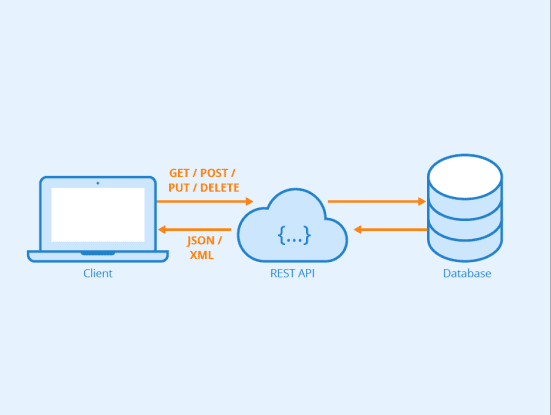

# 什么是 REST API（RESTful API）？

> 原文链接: [REST API 定义：什么是 REST API（RESTful API）？](https://www.astera.com/zh-CN/type/blog/rest-api-definition/)

API（应用程序接口）是一组使不同程序能够相互通信的规则，而 RESTful API 是一种遵循表述性状态传输（REST）架构原则的 API。 它为 Web 应用程序通过 Internet 相互通信提供了一种标准方式。

API 概述了软件开发人员在服务器上编写与各种客户端应用程序通信的程序的适当方法。 不同应用程序的API可以集成在一起来交换数据并执行特定功能，从而实现应用程序之间的交互。 Amazon、Google、Facebook、LinkedIn 和 Twitter 等各种网站都使用 RESTful API 来允许用户与这些云服务进行通信。

本博客将深入探讨 RESTful API 的定义并涵盖其所有基本方面，包括 REST API 代表什么、其原理、方法等。

## 什么是REST API?

2000 年，Roy Fielding 将 REST 定义为一种经常用于互联网服务开发（例如分布式超媒体系统）的架构风格和方法。

> REST API 的完整形式是表述性状态传输应用程序编程接口，通常称为 REST API Web 服务。 这意味着当调用 RESTful API 时，服务器将返回客户端系统所请求资源的到客户端系统。

例如，当开发人员请求 Twitter API 获取用户的对象（资源）时，API 将发回该用户的状态、用户的姓名、关注者以及在 Twitter 上共享的帖子。 这是可能的，因为 API 集成项目。

此状态表示可以采用 JSON、XML 或 HTML 格式。

## REST API的优点

REST API 是最常用的 API，因为它们具有多种优势： 以下是开发人员更喜欢使用 REST API 的原因：

1. 简单易用：
   REST API 相对易于理解和使用，因为它们遵循标准 HTTP 方法（GET、POST、PUT、DELETE）并使用资源表示的标准约定（通常是 JSON 或 XML）。

2. 可扩展性：
   RESTful 服务可以轻松水平扩展，因为它们是无状态的。 来自客户端的每个请求都包含满足该请求所需的所有信息，这使得分发和负载平衡变得更加容易。(`有状态服务`和`无状态服务`)

3. 灵活性：
   REST 允许多种数据格式，但 JSON 由于其简单且易于解析而最常用。 这种灵活性使得 REST API 适用于各种类型的客户端和应用程序。

4. 无国籍：
   从客户端到 REST API 的每个请求都是独立且无状态的。 服务器不需要在请求之间存储有关客户端的任何信息，从而简化了客户端和服务器的设计和实现。

5. 互操作性：

   REST API 独立于平台，可以用任何编程语言实现。 客户可以轻松地以不同的技术使用它们，从而提高互操作性。

6. 可缓存性：

   REST 支持缓存机制，允许客户端缓存响应。 这可以提高性能并减少服务器的负载，特别是对于不经常更改的资源。

7. 统一接口：

   开发人员可以更轻松地使用 RESTful API，因为它们具有统一且一致的接口。 这种一致性可以归因于资源 URI、HTTP 方法和表示格式的标准化。

8. 减少延迟：

   REST 的无状态特性消除了服务器存储有关客户端的信息的需要，从而减少了总体延迟。 客户端可以在每个请求中包含所有必要的信息，服务器则使用所需的数据进行响应。

9. 易于集成：

   RESTful API 的开发过程非常简单，因为它们可以轻松地与不同的系统集成。

10. 安全性：

    您可以使用标准 HTTPS 协议轻松保护 REST API 的安全，并在客户端和服务器之间建立安全的通信通道。 此外，您还可以实施身份验证和授权机制来控制对资源的访问。

> "有状态"和"无状态"这两个术语是描述服务或系统在处理请求时是否保留状态信息的属性。
>
> * **有状态**：在有状态系统中，服务端会记录客户端的状态信息，这意味着服务端在处理请求时会考虑到之前的交互历史或上下文。这种状态可以包括会话数据、用户认证信息等。**"有状态"表示系统在处理请求时要考虑到先前的状态或上下文**。
>
>   ​	想象你去餐厅吃饭。服务员记住了你的菜单选择和饮料偏好。这种服务是有状态的，因为服务员在整个用餐过程中保持了对你的状态的追踪和记忆。
>
> * **无状态**：相比之下，在无状态系统中，服务端不会保存客户端请求的状态信息。每个请求都是独立的，服务端在处理请求时不考虑先前的交互历史或上下文。**"无状态"表示每个请求都是相互独立的，服务端不保存任何关于之前请求的信息**。
>
>      想象你去自助餐厅。你每次去取食物时，服务员不会记住你上一次取了什么。每次你取食物，他们只会为你提供服务，而不会保留任何关于你之前取过什么的信息。这种服务就是无状态的。

## REST API的挑战

毫无疑问，REST API 提供了许多好处。 然而，这并不意味着他们不会面临自己的一系列挑战。 以下是与使用 REST API 相关的一些常见挑战：

1. **数据过度获取或获取不足：** 客户端可能会收到比特定操作所需的更多数据（过度获取）或没有足够的数据（获取不足），这可能导致带宽使用效率低下并影响性能。
2. **对实时通信的有限支持：** RESTful API 基于请求-响应模型，因此它们并不适合实时通信。 您可以采用长轮询或 WebSocket 等技术，但 REST 本身并不支持它们。
3. **版本控制：** 您需要随着 API 的发展而实施更改。 然而，管理向后兼容性和版本控制可能具有挑战性，特别是在处理大量用户群和多个版本的客户端时。
4. **缺乏可发现性：** 如果没有适当的文档，发现可用资源及其功能可能会具有挑战性。 REST API 通常依赖于外部文档，并且没有动态发现资源的标准方法。
5. **安全问题：** 虽然您可以使用 HTTPS 和身份验证机制来保护 REST API 的安全，但安全性仍然是一个问题。 您必须实施适当的身份验证、授权和加密，以确保数据的机密性和完整性。
6. **无国籍：** 虽然无国籍是一个好处，但在某些情况下也可能是一个挑战。 某些应用程序可能需要服务器端状态管理，而 REST 本身并不支持这种管理。
7. **复杂的嵌套资源结构：** 在处理资源之间的复杂关系时，设计简洁直观的 URI 可能具有挑战性。 深度嵌套的资源结构可能会导致 URI 过长且复杂，从而使 API 不太用户友好。
8. **对交易的支持不足：** RESTful API 通常缺乏对涉及多个操作的事务的内置支持。 协调多个请求以确保原子性可能很复杂，并且可能需要额外的设计考虑。
9. **性能开销：** REST API 可能会产生性能开销，尤其是在处理大量小请求时。 通过批处理或分页等技术可以在一定程度上缓解这种情况。(==请求合并==)

## Rest与Soap API

典型的数据传输协议，例如 SOAP（简单对象访问协议），提供了极好的 [数据安全性和完整性](https://stackify.com/soap-vs-rest/) 能力。 此外，SOAP 还提供内置的重试逻辑来补偿不成功的通信。 但这样的协议也很难使用。 RESTful API 是一种更简单的替代方案，在过去几年中呈指数级发展。 人们经常对 REST 标准感到困惑。 相比[ SOAP](https://www.astera.com/zh-CN/type/blog/soap-vs-rest/)，较旧的Web服务，REST更灵活，更容易实现。 以下是休息和肥皂之间的一些区别：

1. **协议：** Soap 使用 XML 作为其消息格式，并且经常依赖其他协议（例如 HTTP 和 SMTP）进行消息传输。 另一方面，Rest 是一种使用标准 HTTP 方法（GET、POST、PUT、DELETE）的架构风格，并且可以支持各种消息格式，例如 JSON 或 XML。
2. **讯息格式：** 与其他格式相比，SOAP 用于构造消息的 XML 格式更加冗长和复杂，而 REST 支持各种消息格式，其中 JSON 是最常见的，因为它简单且易于解析。
3. **有状态性：** SOAP 可以设计为有状态或无状态，具体取决于需求。 然而，REST本质上是无状态的。 从客户端到 RESTful 服务的每个请求都包含满足该请求所需的所有信息。
4. **传输协议：** REST 主要依赖 HTTP 进行通信。 SOAPS 使用 HTTP 等协议，但它也可以在其他传输协议上工作。
5. **标准：** 由于 REST 依赖于标准 HTTP 方法和状态代码，因此它的规定性较少，并且在实现上更加灵活。 SOAP 遵循 WS-Security 等安全功能的特定标准，并具有一组标准化的规则。
6. **性能：** 由于 XML 解析开销和 XML 格式的冗长，SOAP 通常效率较低。 而 REST 的性能更好，特别是在负载较小以及使用 JSON 等更轻量级的数据格式时。
7. **错误处理：** SOAP 标准化了用于错误处理的错误元素，而 REST 使用标准 HTTP 状态代码进行错误处理，从而提供了更简单、更一致的方法。
8. **工具支持：** SOAP 拥有完善的工具和框架，特别是在企业级环境中，而 REST 拥有各种工具和库的广泛支持，使其成为 Web 和移动应用程序的流行选择。
9. **整合：** SOAP 通常用于企业级集成以及需要严格遵守标准的场景，而 Rest 更适合 Web 和移动应用程序，提供轻量级且灵活的集成方法。

## Rest API 相对于 Soap 的优势

### 带宽使用情况

REST 通常优于更强大的 SOAP，因为前者使用 [带宽较小](https://searchapparchitecture.techtarget.com/definition/RESTful-API)，使其更加适合全球的综合网络服务。 它使用HTTP协议来获取数据或以多种数据格式（如XML和JSON）执行操作； 它允许更快的流程。 因此，SOAP 使用 XML 数据传输，将操作定义为单向 WSDL 端口，其中多个流程实例共享相同的过程。 在 REST 中，操作在消息本身中进行描述。 此外，每个流程实例都有一个方向。

### 耦合方式

SOAP 和 REST 协议的耦合方法有所不同。 具体来说，SOAP 具有紧耦合性，而 REST 具有弱耦合性。 SOAP 中的紧密耦合意味着模块是相互依赖的，对一个模块的任何更改都可能会扰乱其他模块的操作。 弱耦合意味着模块是独立的，一个模块的变化不会影响其他模块的运行。 这在添加、替换或调整模块时提供了灵活性和可重用性。 另一方面，紧密耦合意味着模块往往是相互依赖的。 因此，一个模块的变化可能会对整个系统产生影响。 所有这些差异使得 API 变得 RESTful。

### 易于实施

由于其更简单的数据格式和架构，RESTful API 比 SOAP 更容易实现。 RESTful API 不需要单独的消息传递层来在系统之间进行通信，这使其成为更快的替代方案。 此外，RESTful API 独立于平台，使其灵活且可跨不同编程语言访问。

### RESTful API的应用

一些应用程序和项目正在使用 REST API 来传输数据，并且企业越来越多地采用 RESTful Web 服务来享受横向增长。

## REST API 如何工作？

REST 决定了一个结构 [API](https://www.astera.com/zh-CN/knowledge-center/what-does-api-stand-for/)。 开发人员在设计 API 时必须遵守一组特定的规则。 例如，一项法律规定链接到 URL 应该返回一些信息。

系统知道每个 URL 都是一个请求，并且知道作为响应返回的数据。

REST API 分解事务以生成一系列小组件。 每个组件都涉及交易的特定基本方面。 这种模块化使其成为一种灵活的开发方法。

REST API 利用以下描述的 HTTP 方法 [RFC 2616 协议](https://tools.ietf.org/html/rfc2616)。 它使用以下 HTTP 请求：

* **GET** **请求** 获取数据
* **PUT** **请求** 改变数据的状态（例如对象、文件或块）
* **POST请求** 创建数据
* **删除请求** 消除它

此处可以看到 REST API 使用的不同 HTTP 动词或状态代码。

## RESTful API 有何用途？

让我们考虑一个示例来更好地理解 RESTful API 的使用和功能。

假设您想观看有关“[数据集成](https://www.astera.com/zh-CN/type/blog/data-integration/)' 在YouTube上。 您转到 YouTube，在搜索字段中输入“数据集成”，然后按 Enter 键，就会出现有关数据集成的视频列表。 

RESTful API 的工作原理类似。 您寻找某些东西，并从您请求的服务中返回结果列表。

在REST技术中，假设所有调用都是无状态的。 这意味着 REST 服务无法在执行之间保留任何内容，这使其在云应用程序中受益。 无状态组件可以在发生故障时轻松重新分配，并可以扩展以考虑负载变化，因为任何请求都可以发送到组件的任何实例。

REST 之所以成为互联网通信理想的协议，是因为它不保留任何需要后续事务调用的数据。 如前所述，REST API 技术对于连接云应用程序也很有帮助，因为通过 API 访问服务需要调整 URL 解释。

## 了解基本术语

在深入探讨设计 REST API 的指导原则之前，我们先简要讨论三个关键的 API 术语：

### 客户

客户端是使用服务器可访问的 API 的硬件或软件。 例如，当您访问 Facebook 的网站时，您的浏览器是调用 Facebook 的 API 并利用发回的数据在屏幕上显示信息的客户端。

### 资源中心

资源可以是 API 可以提供相关信息的任何对象。 例如，对于 Twitter API，资源可以是用户、主题标签或任何媒体类型（例如图片）。 每个资源都有一个独特的标识符，可以是名称或编号。

资源是 REST 中信息的主要抽象。 REST API 使用资源标识符来识别不同元素之间通信所涉及的特定资源。

### 服务器

服务器是包含客户端所需资源的任何系统。 当它接收到客户端请求时，它使用API接口向客户端提供内容。 服务器仅授予源的代表性状态，而不授予客户端完整的访问权限。

一个很好的例子是移动应用程序通过其界面显示 YouTube 视频。 它使用 REST API 调用来自 YouTube 的视频内容，而无需将其托管在其系统上。

## 人们为什么选择 REST API？

以下是导致 REST API 需求增加的一些好处：

### 可扩展性

REST API 提供出色的可扩展性。 由于客户端和服务器是分离的，因此开发团队可以轻松扩展产品。
此外，将 REST 与现有站点集成起来更加容易，而无需重构网站基础设施。 这使得开发人员能够更快地工作，而不是花时间从头开始重新设计网站。 作为替代方案，他们只能添加额外的功能。 这使其成为最常用的集成方法。

### 灵活性和便携性

即使 REST 客户端服务器托管在 [不同的服务器](https://bbvaopen4u.com/en/actualidad/rest-api-what-it-and-what-are-its-advantages-project-development)，从管理层的角度来看，提供了重要的好处。

### 独立

由于客户端和服务器之间的分离，REST 协议使得跨不同领域的开发很容易自主进行。 此外，REST API 可根据操作语法和平台进行调整，从而提供了在开发过程中测试多种环境的前景。

## REST API设计原则

现在我们已经介绍了基础知识并了解了 REST API 的定义，接下来让我们继续讨论指导 API 设计的六个 REST 原则：

### 客户服务器

REST 原则的运作理念是客户端和服务器应该相互隔离并允许独立开发。 这样，您可以通过简化服务器组件来提高跨多个平台的可管理性并提高可扩展性，因为用户界面问题与数据存储问题是分开的。

### 无状态

此 REST 原则规定 API 是无状态的，允许进行独立调用。 此外，每个呼叫都包含有效完成呼叫所必需的数据。

换句话说，从客户端发送到服务器的每个请求都必须包含理解该请求所需的所有信息。

### 可缓存的

随着无状态 API 的兴起 [请求开销](https://books.google.com.sa/books?id=Gg0sCgAAQBAJ&pg=PA9&lpg=PA9&dq=stateless+API+can+increase+request+overhead&source=bl&ots=IhG2ZW-Tt_&sig=ACfU3U1CLkXJeAEo9Fr8-OJUVeu8boOLog&hl=en&sa=X&ved=2ahUKEwjHrv6ssJLnAhUCC2MBHX4cDu8Q6AEwCnoECAYQAQ#v=onepage&q=stateless API can increase request overhead&f=false) 通过管理大量的入站和出站调用，REST API 设计应该存储可缓存的数据。 根据此 API 设计原则，响应中的数据应间接分类为可缓存或不可缓存。

如果响应是可缓存的，则客户端缓存有权为将来的类似请求回收该响应数据。(==接口的幂等性==)

### 统一界面

为了将客户端与服务器解耦，您需要有一个统一的接口，允许应用程序自主开发，而无需将其服务、模型和操作与 API 层本身紧密耦合。这种设计原则简化了整个系统架构并增强了可见性一些架构控制需要指导 REST API 架构中元素的性能以获得统一的接口。

REST API 架构通过四个接口控制定义了 REST 原则，包括识别资源、通过表示管理资源、支持自描述通信以及使超媒体成为应用程序状态的引擎。

### 分层系统

REST API 的架构包括多个层，这些层一起运行以构建层次结构，帮助生成更具可扩展性和灵活性的应用程序。 由于其分层系统，应用程序具有更好的安全性，因为每一层中的组件都不能与后续层之外的组件进行交互。 此外，它还平衡负载并提供共享缓存以刺激 [可扩展性](https://www.edureka.co/blog/what-is-rest-api/#Need of REST API).

分层的REST API架构系统由于限制了组件性能，因此具有更高的稳定性。 这样每个组件就无法“看到”比它所混合的直接层更远的地方。

### 按需编码

REST 原则允许通过应用程序内使用的 API 进行编码或小程序的通信。

REST API 定义允许通过下载和实现小程序或脚本形式的编码来扩展客户端功能。 这通过减少需要预先实现的必需功能的数量来简化客户端。

大多数时候，服务器以 XML 或 JSON 格式返回静态资源表示。 但当需要时，服务器可以向客户端提供可执行代码。

## Astera API 管理使 REST API 集成变得简单

REST API 集成对于新开发人员来说可能很棘手，因为您可能会失去在 REST 中保留状态的能力，例如在会话中。 像这样的解决方案 [Astera API管理](https://www.astera.com/zh-CN/products/astera-api-management/) 提供拖放式、免代码界面，可简化开发、管理和集成 REST API 的过程，而无需编写 SQL 脚本。

该解决方案具有直观、可视化的用户界面，可简化整个流程并提高生产力。 想看看如何 Astera API 管理可以简化您的 REST API 管理吗？ 查看 [免费试玩](https://www.astera.com/zh-CN/astera-api-management-demo/).