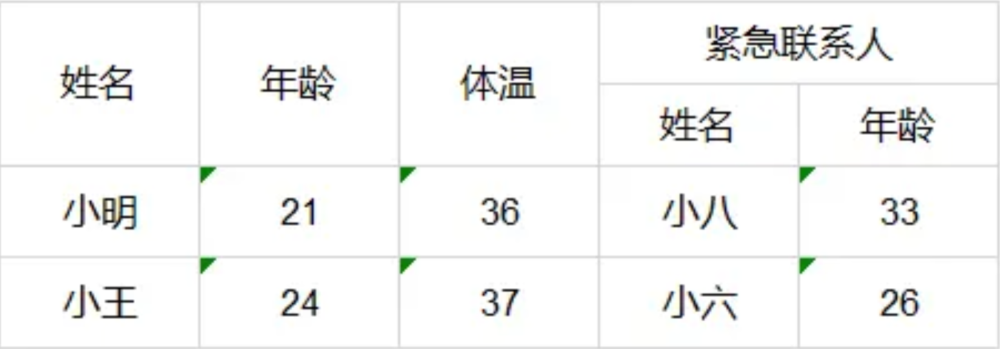

# 导出自定义表头



```java
List<Map<String,Object>> dataList = new ArrayList<Map<String,Object>>();
Map<String,Object> map1 = new HashMap<>();
map1.put("name","小明");
map1.put("age","21");
map1.put("degree","36");
map1.put("link_name","小八");
map1.put("link_age","33");
dataList.add(map1);

Map<String,Object> map2 = new HashMap<>();
map2.put("name","小王");
map2.put("age","24");
map2.put("degree","37");
map2.put("link_name","小六");
map2.put("link_age","26");
dataList.add(map2);

List<ExcelExportEntity> entityList = new ArrayList<>();
//一般表头使用这种两个参数的构造器
ExcelExportEntity e1 = new ExcelExportEntity("姓名","name");
ExcelExportEntity e2 = new ExcelExportEntity("年龄","age");
ExcelExportEntity e3 = new ExcelExportEntity("体温","degree");
entityList.add(e1);
entityList.add(e2);
entityList.add(e3);
//需要被设置成子表头的使用这种三个参数的构造器,设置colspan为true
ExcelExportEntity e5 = new ExcelExportEntity("姓名","link_name",true);
ExcelExportEntity e6 = new ExcelExportEntity("年龄","link_age", true);
entityList.add(e5);
entityList.add(e6);
//合并表头也需要设置colspan为true
ExcelExportEntity e4 = new ExcelExportEntity("紧急联系人","linkman",true);
List<String> sub = new ArrayList<>();
sub.add("link_name");
sub.add("link_age");
//还需要设置一个子表头key的集合
e4.setSubColumnList(sub);
entityList.add(e4);

Workbook wb = ExcelExportUtil.exportExcel(new ExportParams(null, "sheetName"),entityList,dataList);
```

